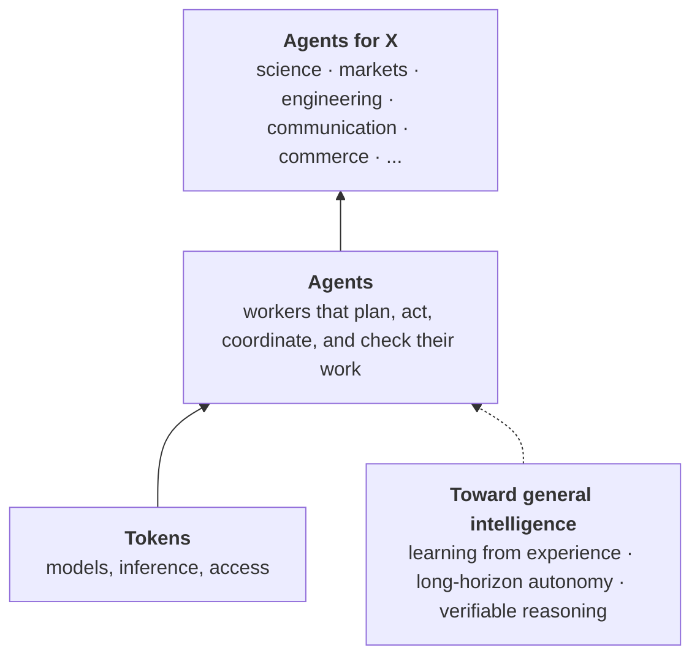

# Agent Next

**Building an agentic world.**

Models can now reason, write, and use tools. The next step is agents: systems that pursue goals, act over long horizons, work with other agents and with people, and produce results that can be checked.

Major technologies have changed the world less through the invention itself than through the systems built around it: infrastructure, methods, and new ways of organizing work. For agents, most of those systems do not exist yet. Agent Next builds them.

## The map

## What we work on

- **Agent infrastructure.** From tokens to agents: efficient access to models, and the runtimes, coordination, and evaluation that let agents operate reliably at scale.
- **Agents for science.** Agents that take part in discovery: forming hypotheses, running experiments in simulation and in the lab, and checking what they find.
- **Agents for X.** Agents doing sustained, consequential work across fields, from markets and engineering to communication and commerce.
- **Toward general intelligence.** Research on what agents still lack: learning from experience, long-horizon autonomy, organization among many agents, and reasoning that can be verified.

## The question we work on

What systems must exist for agents to become a fundamental way of creating knowledge and doing work?

[Website](https://agent-next.com) · [Notes](https://agent-next.com/blog/) · [Contributing](https://github.com/agent-next/.github/blob/main/CONTRIBUTING.md)
